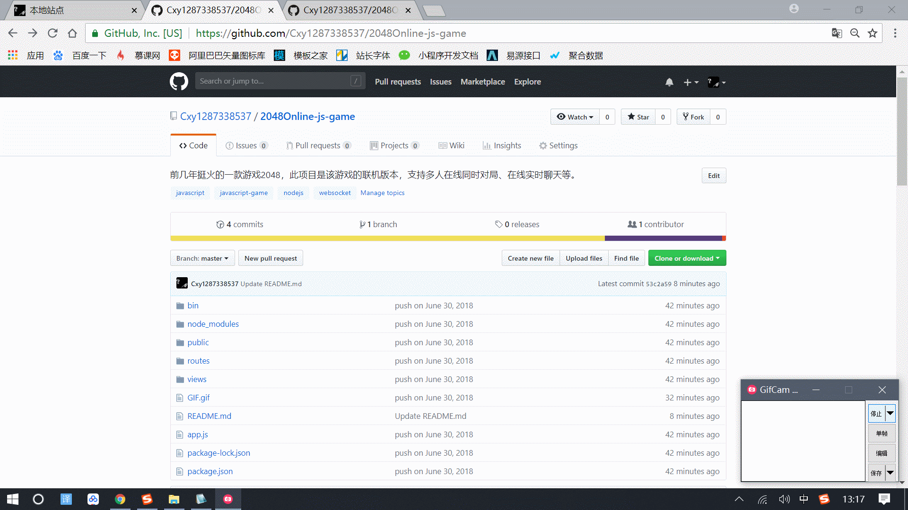

# 2048多人在线小游戏

做这个项目是因为当时刚接触nodejs的学习，用来练一下手。

项目用时共计四天，本人负责前后端的所有开发，项目功能已经比较完善。

在线联机地址(可能已经关闭)：[2048多人在线小游戏](http://119.23.53.56/2048)

## 效果预览


## 项目功能介绍

- [x] 支持多人在线同时联机进行游戏对局。

- [x] 支持在线实时聊天，分为世界聊天(一对多)、房间聊天(一对一)两种形式。房间聊天还可以发送表情。

## 技术总结

- [x] HTML5、CSS3、JavaScript的基本使用

- [x] 使用nodejs进行项目后台开发

- [x] express、nodejs-websocket等nodejs模块的使用

- [x] HTML5 webSocket的使用

## 获取项目

* 将本项目git到本地目录

```

$ git clone https://github.com/Cxy1287338537/2048Online-js-game.git

```

* 在项目目录打开cmd，执行命令 `npm start` (此步骤需先安装nodejs)

* 在浏览器中输入网址 `http://localhost/2048` 即可

### 步骤图解(直接下载zip的方法)



## 联系方式

欢迎各位志同道合的朋友来找我呀！大家一起学习，才能进步得更快，下面是我的联系方式：

- [x] 微信： Jack1287338537

- [x] 邮箱： 13560784981@163.com
